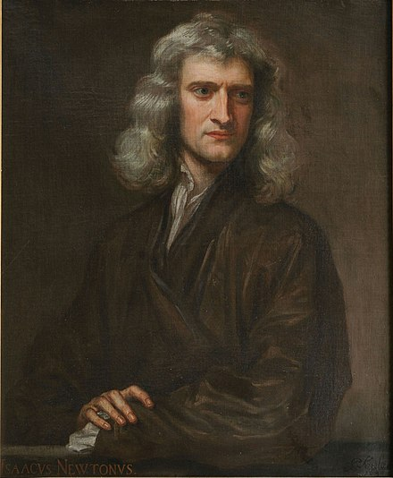
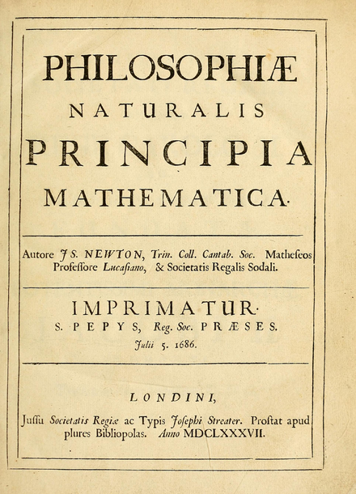
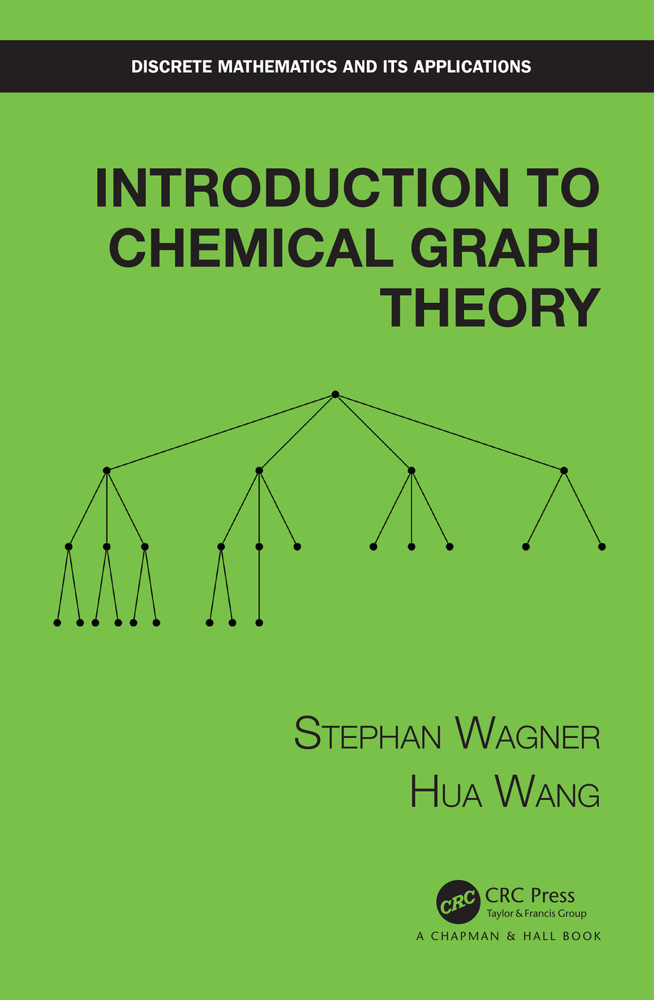
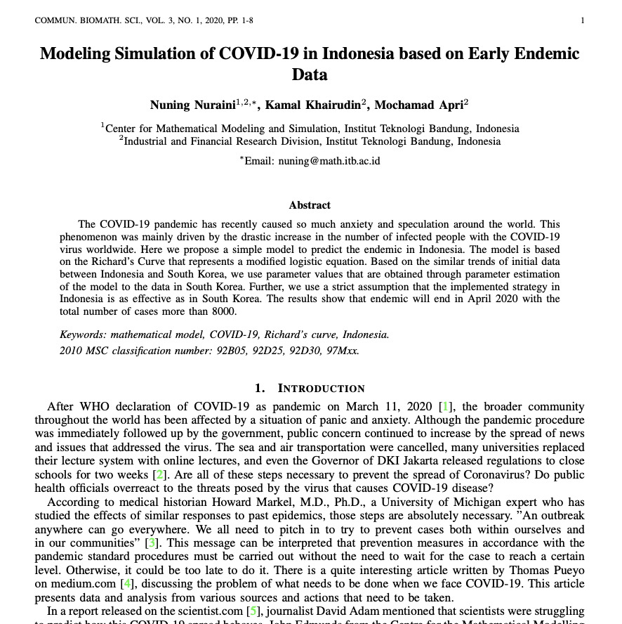
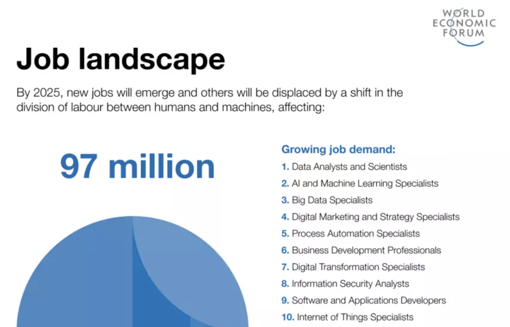
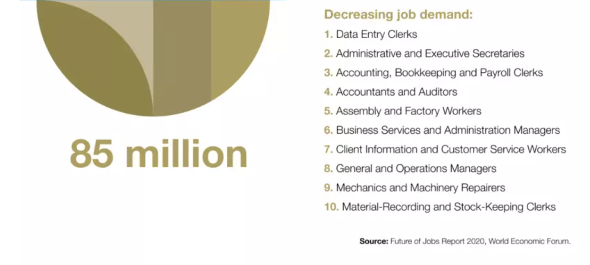
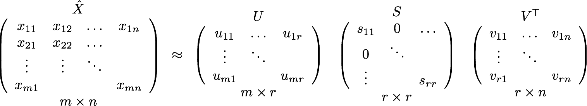
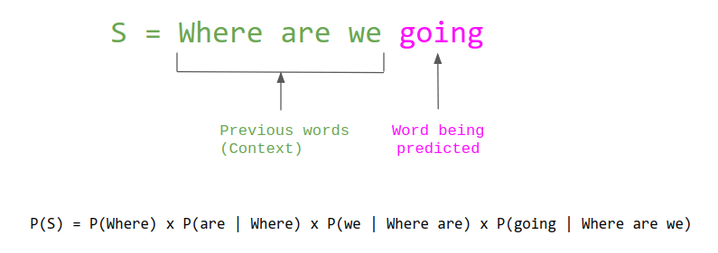

# Matematika dalam Lanskap Industri

---
<!-- paginate: true -->

Halo, nama aku Dani 👋🏻

* Sains Komputasi ITB
  *(2017 - 2019)*
* Matematika Universitas Airlangga
  *(2012 - 2016)*

---
<!-- paginate: true -->

## Experiences

* Data Science Lead Instructor & Engineer at [Bitlabs](https://bitlabs.id/)
  *(Jul 2021 - present)*
* Data Science Engineer at [Kurio](https://kurio.id/)
  *(Jul 2019 - Jun 2021)*
* Data Scientist at [Bareksa](https://www.bareksa.com/)
  *(Des 2018 - Apr 2019)*

---
<!-- paginate: true -->
# Agenda

* Historical Timeline of Mathematics
* Areas of Mathematics
* Mathematics and Life Sciences
* Applied Mathematics in Industry
* The Benefits of Mathematics
* Some Fun Facts about Math
* How I Apply Math at Work

---
<!-- _backgroundColor: black -->
<!-- _color: white -->

# DISCLAIMER

---
<!-- paginate: true -->
# Mathematics Historical Timeline

<iframe src="https://mathigon.org/timeline" title="Mathematics Timeline" style="border: none;" width="1000" height="500">
</iframe>

<!--
Dari sini terlihat bahwa kontribusi matematika terbanyak terjadi pada abad ke-19 dan 20.

Di abad ke-20, perkembangan matematika terjadi mengikuti perkembangan ilmu fisiika dan sains lainnya.

-->

---
<!-- paginate: true-->
# Areas of Mathematics

---
<!-- paginate: true -->
## Traditionally speaking

Adapted from [wikipedia](https://en.wikipedia.org/wiki/Areas_of_mathematics)...

---
<!-- paginate: true -->
<!-- _color: white -->

---
<!-- paginate: true -->
# Pure Mathematics

Mathematics studied for its intrinsic interest
* Mathematical foundations - *proof theory, set theory, etc.*
* Analysis - *functions, limits, derivatives, integrals, etc.*
* Algebra - *field theory, groups, rings, etc.*
* Geometry
* Topology
* Combinatorics
* Number theory

<!--
* mathematicsl foundations discuss logic and symbols.
* analysis is said to be the language of science itself and is used across chemistry, biology, and physics
* algebra is said to be the study of structure
* geometry deals with spatial relationship using fundamental qualities or axioms
-->

---
<!-- paginate: true -->
# Applied Mathematics

Mathematical studies that can be directly applied to real-world problems
* Probability and statistics - *statistics, random variables, events, and other mathematical theory of random phenomena*
* Computational sciences - *numerical analysis, algebraic computation, etc.*
* Mathematical physics - *classical & quantum mechanics, mechanics of structures, fluid mechanics, etc.*
* Operation research (OR) - *mathematical modeling, mathematical optimization, statistical analysis, mathematical programming, etc.*

<!--
* probability and stats deal with any random phenomena
* stats can be thought of as the science of making effective use of numerical data from experiments or from populations of individuals
* numerical analysis is the study of iterative methods and algorithms for approximately solving problems to a specified error bound
-->

---
<!-- paginate: true -->
From [arxiv](https://arxiv.org/archive/math):

* Algebraic geometry
* Algebraic topology
* Combinatorics
* Differential geometry
* Group theory
* Numerical analysis
* Quantum algebra
* Representation theory
* Statistics theory
* etc.

---
<!-- paginate: true -->
From [Society for Industrial and Applied Mathematics (SIAM)](https://siam.org/membership/activity-groups):

* Algebraic geometry
* Applied and computational algorithms
* Computational science and engineering
* Life sciences
* Linear algebra
* Data Science
* Optimization
* Supercomputing
* etc.

<!--
Briding to next slide:
So there's a lot of type of categorization of areas of mathematics.
Then, where does mathematics actually take place in our daily life? especially, in industry?
-->

---
<!-- paginate: true -->
# Where does mathematics take place?

It's a mystery for some people.

Hence, to demistify this, let's first take a look from academia perspective.

---
<!-- paginate: true -->
## In Life Sciences

---
<!-- paginate: true -->

Who's this?

---
<!-- paginate: true -->

Who's this?
**Sir Isaac Newton**

<!--
Who is isaac newton? (asking audience)
When or Where did you know about this person?
What did he write?
-->

---
<!-- paginate: true -->
## Laws of Motion

---

---

---
<!-- paginate: true -->
## How about mathematics in industry?

---
<!-- paginate: true -->
> "Mau kerja jadi apa nanti lulusan matematika? Di bank?"
> <em>overheard in every mathematics major in Indonesia</em>

---

---

---
<!-- paginate: true -->
> "Mau kerja jadi apa nanti lulusan matematika? Di bank?"
> <em>overheard in every mathematics major in Indonesia</em>

---
<!-- paginate: true -->
# Applied Mathematics in Industry

---

---
<!-- paginate: true -->
## Recommendation System

---
<!-- paginate: true -->

## Recommendation System

One of the technique is called **collaborative filtering** and it uses **Singular Value Decomposition**.

---
<!-- paginate: true -->

Gmail's smart compose ([reference](https://www.slashgear.com/gmail-autocomplete-turn-on-smart-compose-right-now-08530148/)).

---
<!-- paginate: true -->

In natural language processing (NLP), language model is a chain of probability of what word come next after some words ([reference](https://thegradient.pub/understanding-evaluation-metrics-for-language-models/)).

---
<!-- paginate: true -->

# How Math Helps (Me)

<!--
Tell a story about how I learned data science, machine learning, and up to this point
* Self-paced learning
* Learning outside formal education, taking online course, researching, reading
* Challenged myself by taking paid internship
* Mathematics is always there as a solid foundation of my learning journey
* Not saying I'm expert at math, I still need to review a lot of basic mathematic laws and concepts
* As long as you have the foundation and eager to learn, then you're probably doing fine
-->

---

# Thank You

Any questions?
